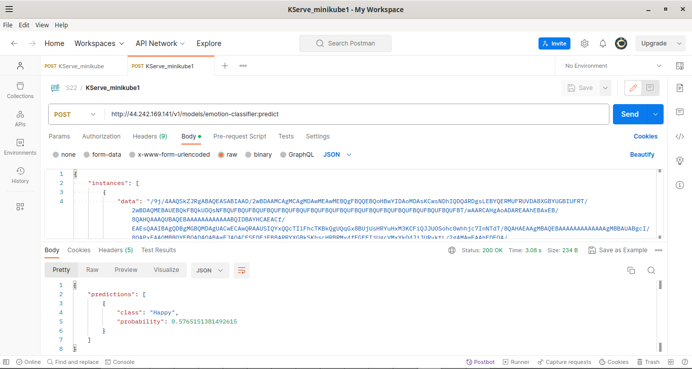
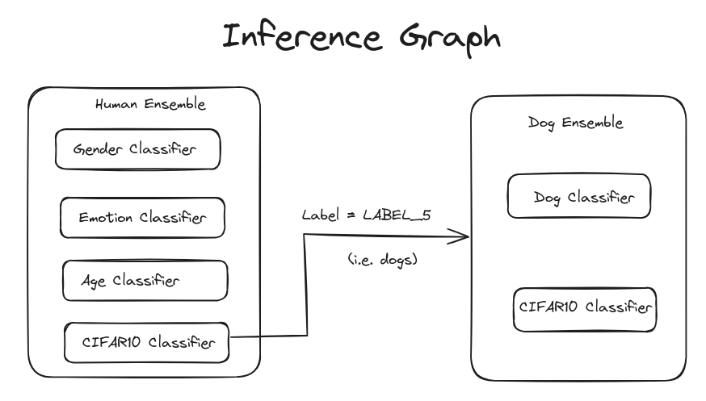
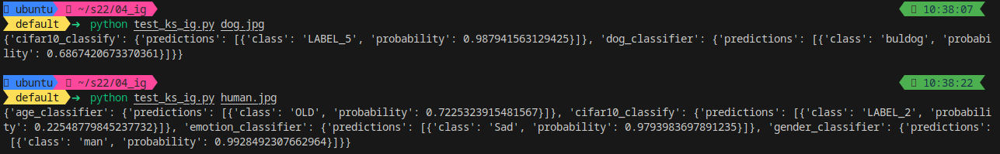
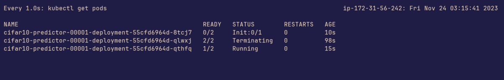
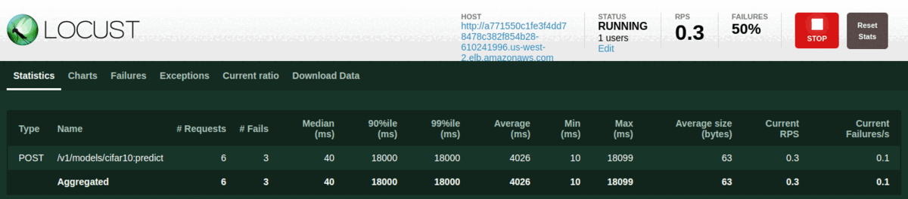
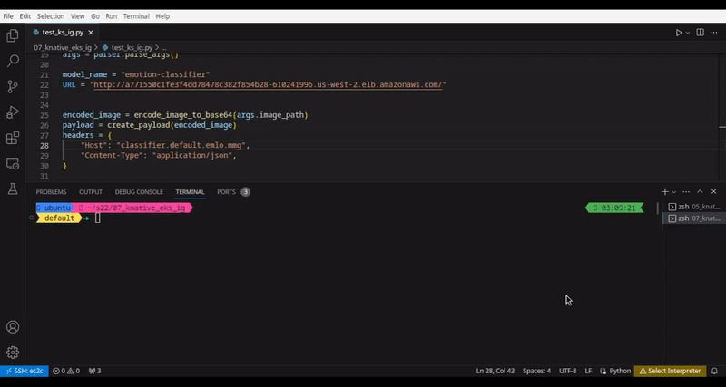

<div align="center">

# Multi-Model Deployment with Scaling on EKS via Knative

</div>

# Overview
In this repository, we deploy multiple models on EKS. We will configure so as to enable scaling down to 0, which is done via Knative in KServe. We will also deploy an Inference Graph, which allows us to run inference - single or multiple - based on predefined conditions.

We will progress one step at-a-time. The steps will be
- choose 5 models from HF and run inference for each model
- test on TorchServe (with CPU)
- setup minikube and test on KServe (with CPU)
- create an Inference Graph on minikube (CPU)
- test one model on GPU (EKS+Knative+scale down to 0)
- create an Inference Graph on EKS (GPU)

# Step 1 : Running Inference on HF Models

The following image classification models have been chosen for inference.
- [nateraw/vit-base-patch16-224-cifar10](https://huggingface.co/nateraw/vit-base-patch16-224-cifar10)
- [Sena/dog](https://huggingface.co/Sena/dog)
- [dima806/man_woman_face_image_detection](https://huggingface.co/dima806/man_woman_face_image_detection)
- [dima806/faces_age_detection](https://huggingface.co/dima806/faces_age_detection)
- [PriyamSheta/EmotionClassModel](https://huggingface.co/PriyamSheta/EmotionClassModel)

We download these models
```bash
python download_all.py
```
To test inference on the models, we can run our test script as
```bash
python test_hf_models.py
```

# Step 2 : Running Inference using TorchServe


Start TorchServe docker container
```bash
docker run -it --rm --shm-size=8g --ulimit memlock=-1 --ulimit stack=67108864 -p 8085:8085 -v `pwd`:/opt/src pytorch/torchserve:0.9.0-cpu bash
```

We need to create MAR archives first.
```bash
cd /opt/src/02_torchserve/
python create_mar.py
```

Then we start TorchServe server
```bash
torchserve --model-store cifar10/model-store --start --models all --ts-config cifar10/config/config.properties --foreground
```

To see the list of models
```bash
curl http://localhost:8085/models
```

We can run an inference as follows. Note that for torchserve, our request is in binary format (unlike KServe, where it is base64 encoded)

```bash
curl http://localhost:8085/predictions/cifar10 -T img.jpg
# OR
python test_ts.py
```

We will upload to S3 for the next steps.

```bash
rm -rf model-store/logs
aws s3 cp --recursive model-store s3://emlo-s22/kserve-mar/
```

# Step 3: Inference on KServe on minikube

See the setup steps [here](./setup.md#step3)

We will create an IAM user with read-only access to the bucket specified in step 2. Copy access key and secret access key in the YAML and apply.
```bash
kubectl apply -f s3_sa.yaml 
```

Then deploy all models

```bash
kubectl apply -f all-classifiers_cpu.yaml
```

To enable public access to our cluster
```bash
minikube tunnel --bind-address 0.0.0.0
```

Test using postman or python script.

For KServe , our request is base64 encoded  (unlike TorchServe, where it is in binary format)


# Step 4:  Inference Graph on minikube


Then we will deploy the inference graph, which looks as follows.



```bash
kubectl apply -f inf_graph.yaml
```

Test using Postman or Python script.

```bash
python test_ks_ig.py
```



We can also run the GPU deployments on minikube running on `g4dn` instance via the following steps.


```bash
sudo nvidia-ctk runtime configure --runtime=docker && sudo systemctl restart docker

minikube start --driver docker --container-runtime docker --gpus all
```
# Step 5:  GPU Deployment and Scale to 0 on EKS
See the setup steps [here](./setup.md#step5)

Let's see how many GPUs we have.

```bash
kubectl get nodes -o json | jq -r '.items[] | select(.status.capacity."nvidia.com/gpu" != null) | {name: .metadata.name, gpu_capacity: {key: "nvidia.com/gpu", value: .status.capacity."nvidia.com/gpu"}}'

```

Only 1! Too bad...:worried:

Let's enable time-slicing to simulate multiple GPUs.
```bash
helm repo add nvdp https://nvidia.github.io/k8s-device-plugin
```

Find name of GPU node and apply a label to it

```bash
kubectl label node {}  eks-node=gpu
```

```bash
helm upgrade -i nvdp nvdp/nvidia-device-plugin \
  --namespace kube-system \
  -f nvdp-values.yaml \
  --version 0.14.0
```

```bash
kubectl apply -f slice.yaml
```

```bash
helm upgrade -i nvdp nvdp/nvidia-device-plugin \
  --namespace kube-system \
  -f nvdp-values.yaml \
  --version 0.14.0 \
  --set config.name=nvidia-device-plugin \
  --force
```


We can see that the node has 16 GPUs :wink:.
```bash
kubectl get nodes -o json | jq -r '.items[] | select(.status.capacity."nvidia.com/gpu" != null) | {name: .metadata.name, gpu_capacity: {key: "nvidia.com/gpu", value: .status.capacity."nvidia.com/gpu"}}'
```


Then deploy any model

```bash
kubectl apply -f cifar10_gpu.yaml
```

We should see no inference service/pod (or atleast one that is created for a short while but gets terminated because of no traffic. Then, we perform load-testing using locust. Pods get created and then terrminated once the test ends.

Pods: (time-jumped screenshots)


Locust: (time-jumped screenshots)



# Step 6: Multi-Model Deployment and Inference Graph on EKS (GPU)
Deploy all classifiers:

```bash
kubectl apply -f all-classifiers_gpu.yaml
```


Then deploy the inference graph.

```bash
kubectl apply -f inf_graph.yaml
```

Finally, to test the Inference Graph, run

```bash
python test_ks_ig.py
```


